# Configure-DHCP-service

Dynamic Host Configuration Protocol (DHCP) – Automated IP Address Management
DHCP (Dynamic Host Configuration Protocol) is a network management protocol that automatically assigns IP addresses, subnet masks, default gateways, and DNS settings to devices on a network. This eliminates the need for manual IP configuration, ensuring efficient and conflict-free network management.

Key Benefits:

✅ Automated IP Assignment – Reduces manual configuration and errors.

✅ Efficient IP Management – Dynamically allocates and reclaims unused IP addresses.

✅ Scalability – Ideal for networks with a large number of devices.

✅ Centralized Control – Simplifies administration with a dedicated DHCP server.

## Summary

In this project, I installed and configured the DHCP protocol on Windows Server. I created an IP address pool, allowing the DHCP server to automatically assign IP addresses to client machines, ensuring efficient and dynamic network management.

## Step - 1

i. **Open Server Manager, then navigate to "Add Roles and Features."**

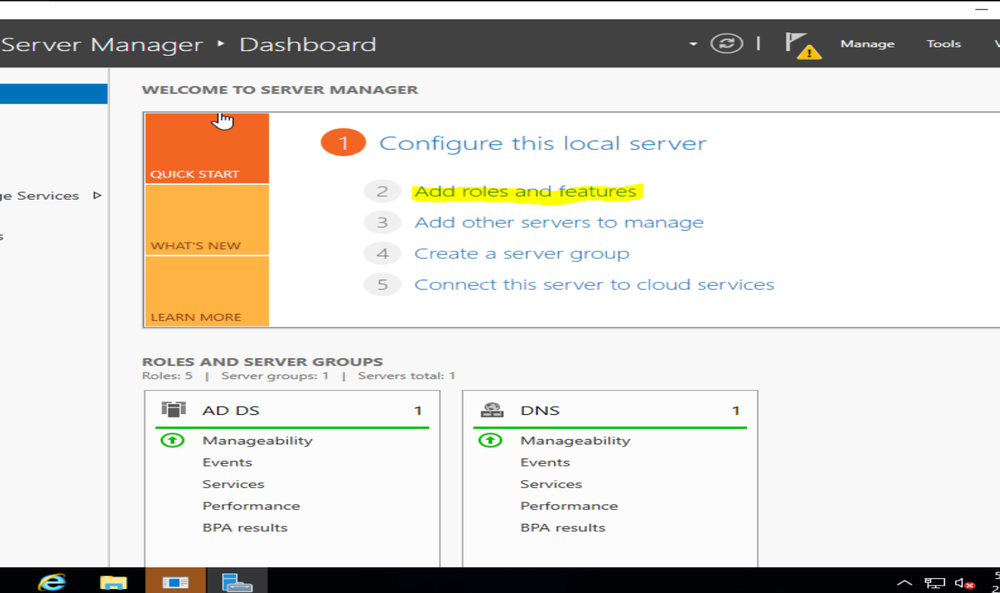

ii. **In "Server Roles," select and add the DHCP Server role.**

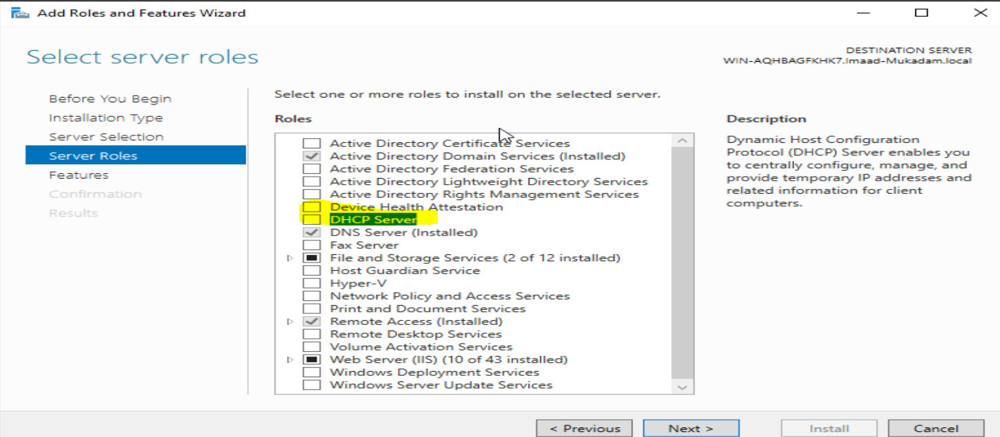

iii. **In the "Confirmation" section, click "Install" to set up the DHCP Server.**

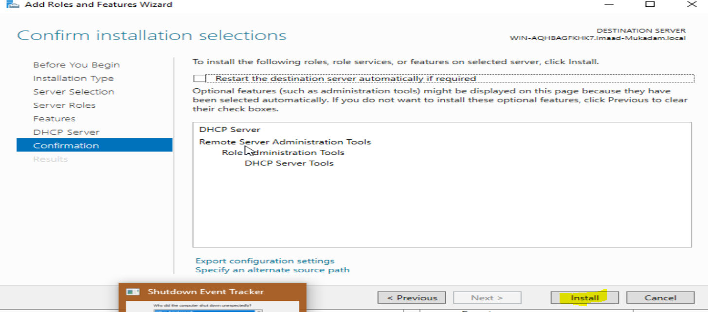

iv. **Once the installation is complete, click on "Complete DHCP Configuration" and follow the steps as shown in the screenshots.**

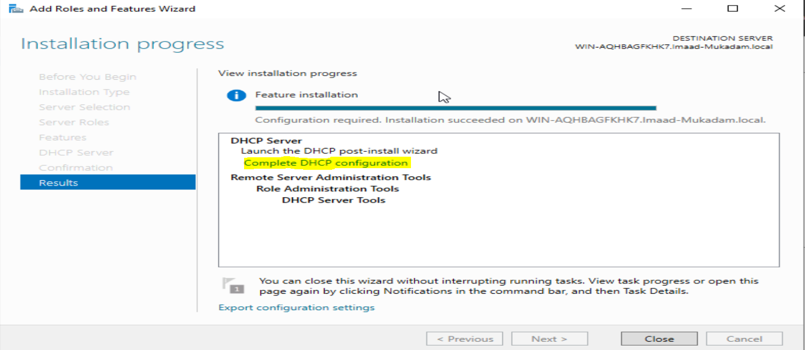

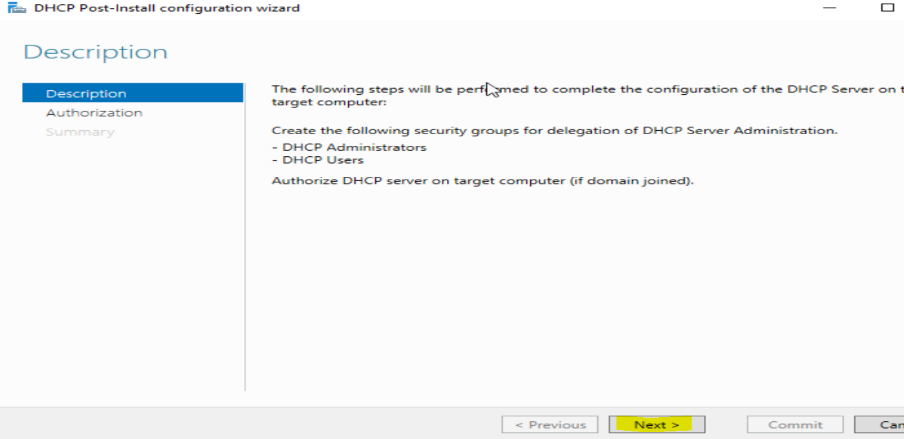

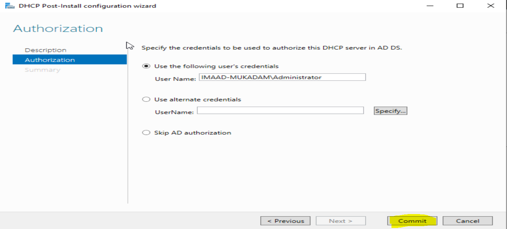

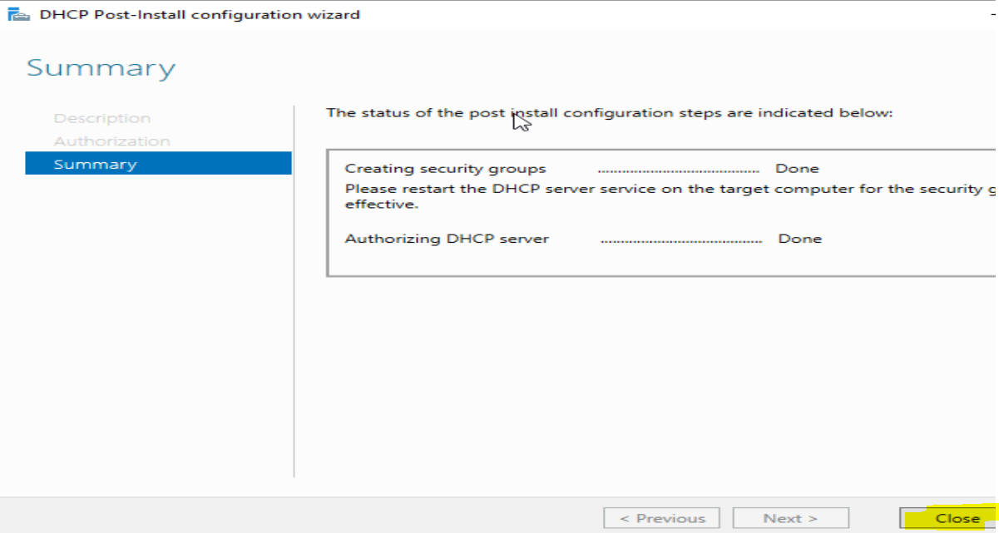

## Step - 2

i. **Go to "Tools" in Server Manager and select "DHCP."**

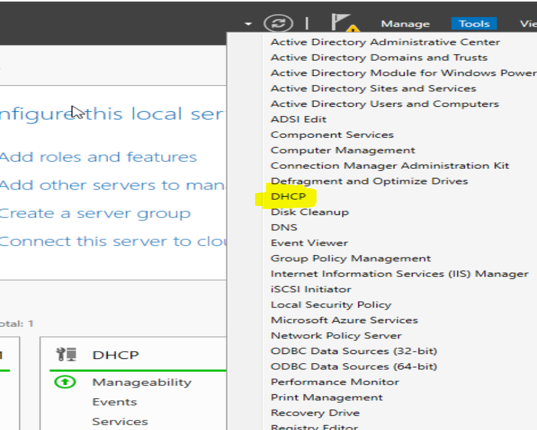

ii. **To add an IPv4 scope, right-click on "IPv4" and select "New Scope."**

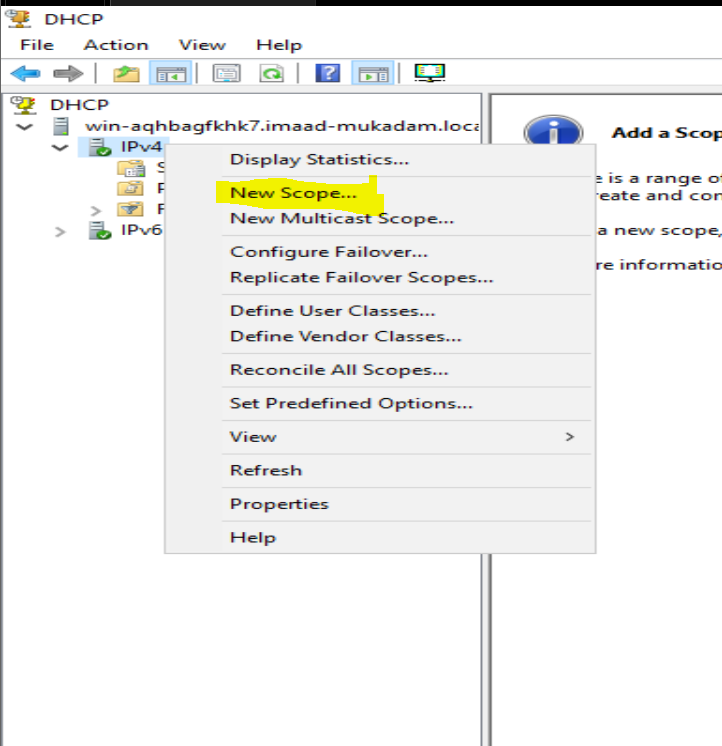

iii. **Enter a name of your choice for the scope and click "Next."**

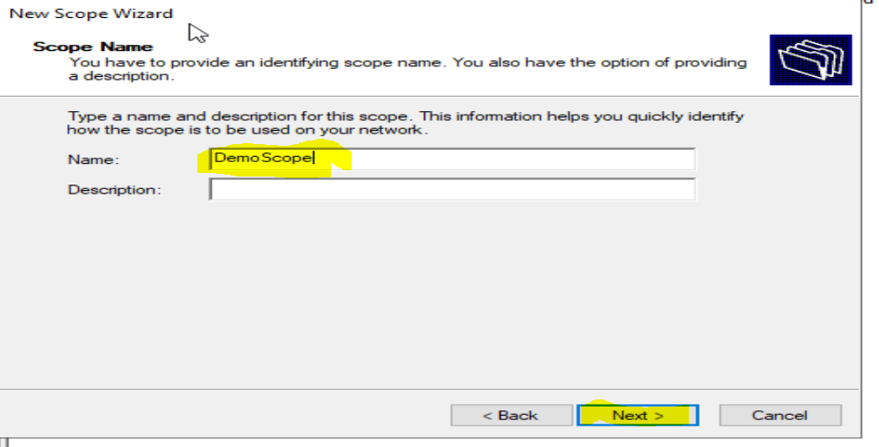

iv. Give start IP range and End Ip range 

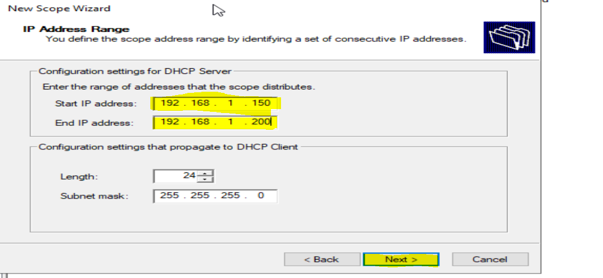

v. In Add Exclusion and Delay in DHCP I'm not going to assign IP 

WHat is Add Exclusion and Delay in DHCP??

Exclusion: Reserves specific IPs so the DHCP server doesn’t assign them, ensuring static IPs for critical devices.

Delay: Adds a response delay in multi-DHCP setups, allowing the preferred server to assign IPs first.

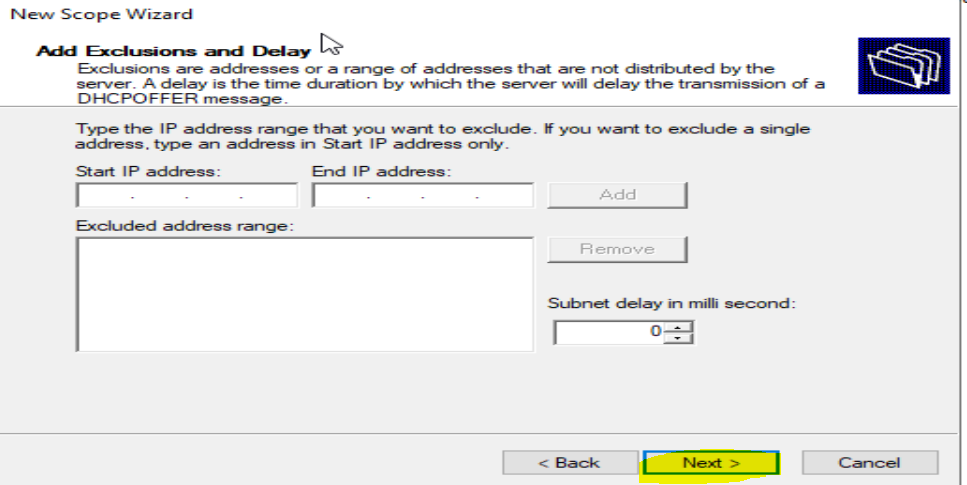

vi. What is Lease Duration?

Lease Duration defines how long a device can use an assigned IP address before it must renew the lease. Shorter durations suit dynamic networks (e.g., Wi-Fi hotspots), while longer durations are ideal for stable environments (e.g., offices).

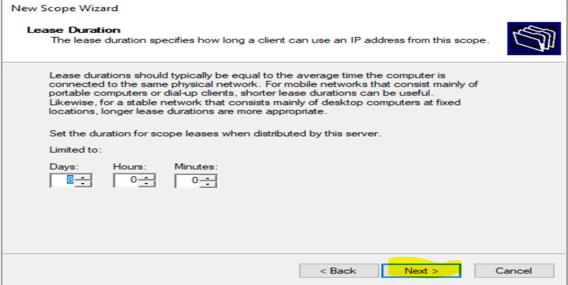

vii. Provide the Default gateway

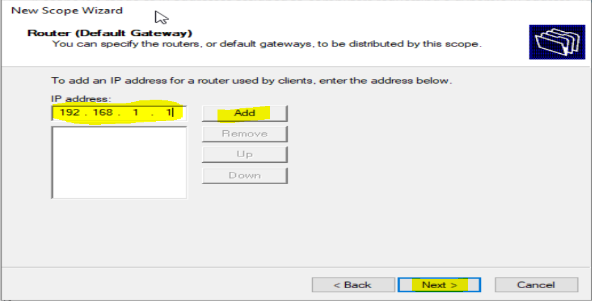

viii. Click next till finish

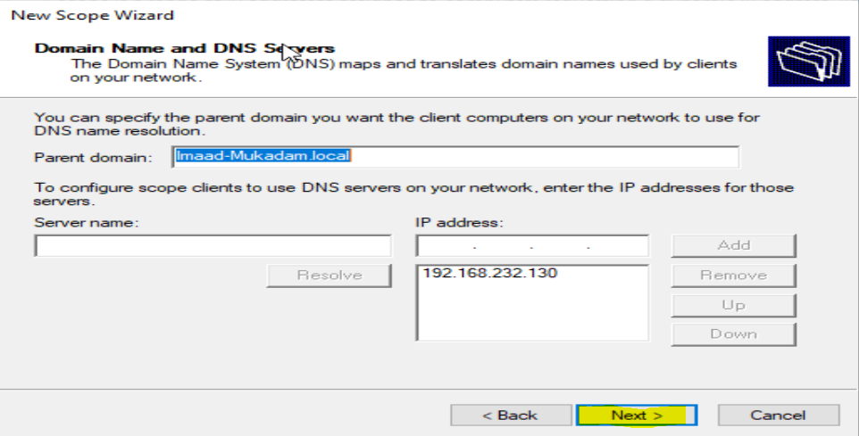

## Step - 3

i. Now lets assign the DHCP IP address to our machine , for this type this command

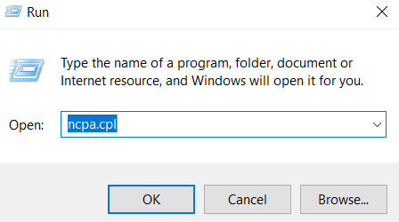

ii. Then go into properties , then click on IPv4 

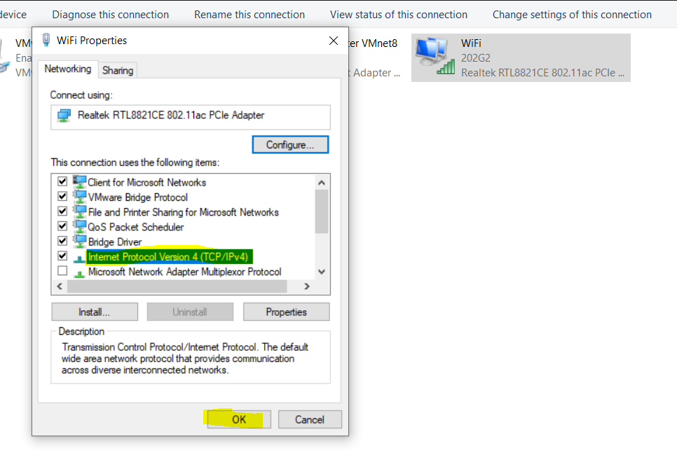

iii. Switch it to Obtain IP address automatically , and Obtain DNS Server Address automatically

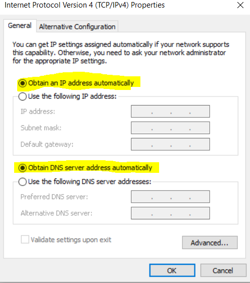

After this , check the status you will see the IP address is dynamically assigned
